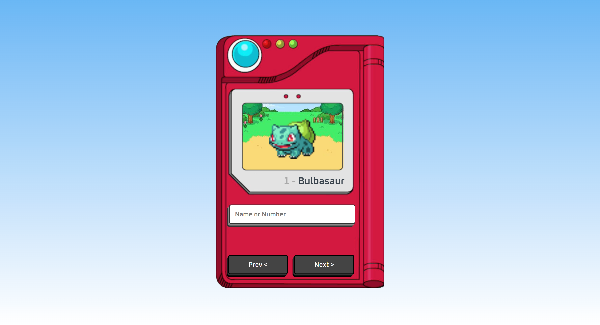
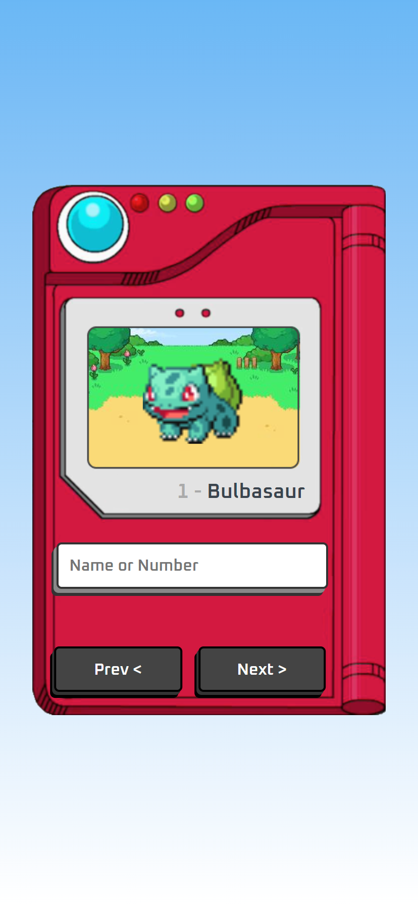

# Pokedex

> Pokédex developed with HTML, CSS and JavaScript

## Table of contents

- [Overview](#overview)
  - [The challenge](#the-challenge)
  - [Links](#links)
  - [Screenshot](#screenshot)
- [My process](#my-process)
  - [Built with](#built-with)

## Overview

### The challenge

Users should be able to:

- DESCRIPTION OF WHAT THE USER CAN DO
<!--- View the optimal layout for the app depending on their device's screen size
- See hover states for all interactive elements on the page
- Add new todos to the list
- Mark todos as complete
- Delete todos from the list
- Filter by all/active/complete todos
- Clear all completed todos
- Toggle light and dark mode
- **Bonus**: Drag and drop to reorder items on the list-->

### Links

- Live Site URL: URL SITE HERE

### Screenshot

  - Desktop
  
    
    
  - Mobile
    
    

## My process

### Built with

- HTML
- CSS
- JAVASCRIPT

[⬆ Back to the top](#pokedex) 
