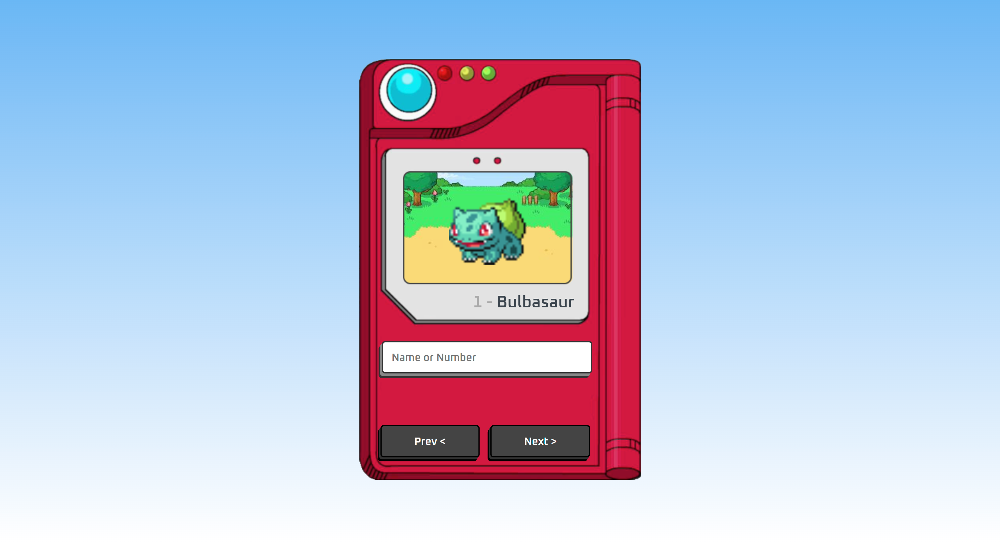
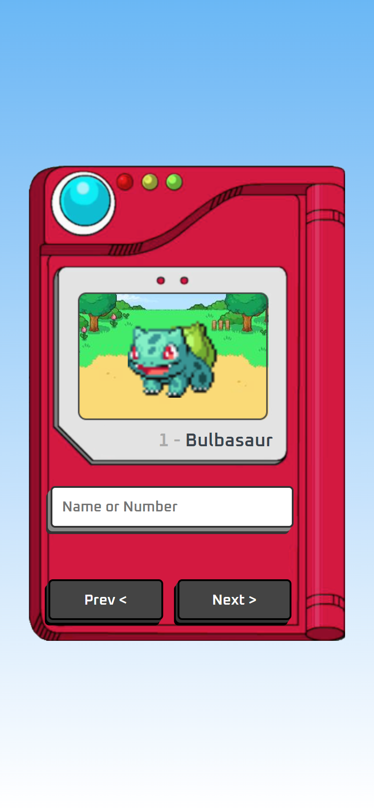

# Pokedex

> Pokédex developed with HTML, CSS and JavaScript

## Table of contents

- [Overview](#overview)
  - [The challenge](#the-challenge)
  - [Links](#links)
  - [Screenshot](#screenshot)
- [My process](#my-process)
  - [Built with](#built-with)

## Overview

### The challenge

Users should be able to:

- Be able to see all pokemons and their information
- Sort pokemon by name and id number
- Switch pokemon with back and next buttons
- Be able to use all the functionality of the project

### Links

- Live Site URL: https://pokedex-pokemon-rafael.netlify.app

### Screenshot

  - Desktop
  
    
    
  - Mobile
    
    

## My process

### Built with

- HTML
- CSS
- JAVASCRIPT

[⬆ Back to the top](#pokedex) 

## Apoie

